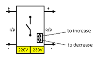
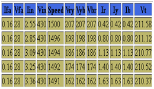
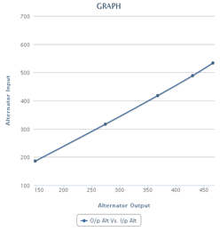

### Load Test on Three Phase Alternator
1. Close DPST (double pole single throw) switch connected to the DC shunt motor and apply voltage in steps till desired speed of the alternator is attained.

2. When desired speed is reached, turn on DC excitation to synchronous generator field winding so that rated value of terminal voltage of alternator in open circuit condition is reached. Now DC excitation will be held constant hereafter
3. To test the machine on load, we insert the resistances from resistive load bank.
4. As we go on inserting resistances, the terminal voltage of 3 phase alternator will reduce and also the speed
5. Store this data by clicking "Start Storing Data"
6. Now again increase the load by closing another load switch.
7. Store this data by clicking "Start Storing Data"
8. Go on repeating this procedure till all load are connected and data is stored.
9. Now display the data by clicking "Show data". For Ex

* Vfa=field voltage of alternator
* Ifa=field current of alternator
* Vin=input voltage DC motor
* Iin=input current of DC motor
* Vt=terminal voltage
* Vry,Vyb,Vbr=line voltage

10. As load is increased, the DC input to the motor will also be increased to bring back the speed of alternator to synchronous speed. Due to voltage regulation effect even though speed is restored drooping characteristics are observed for terminal voltage against line current of alternator.

11. Remove field excitation of sync alternator with DPST switch.
12. Switch off the resistances from circuit of generator
13. Cut off the supply through DPST (double pole single throw) of the for DC shunt motor after making all applied quantities zero.
